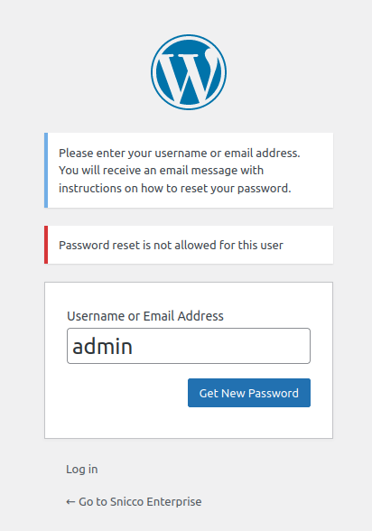
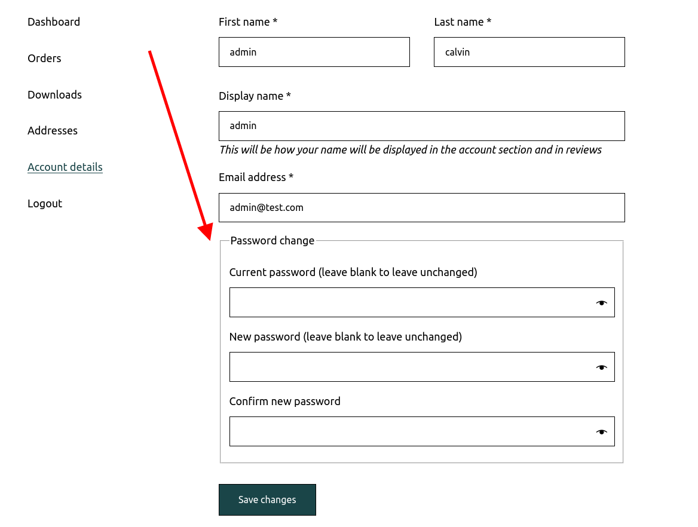

# Disabling password resets for privileged users

<!-- TOC -->
* [Rational](#rational)
* [Implementation](#implementation)
* [Edge cases with third-party plugins](#edge-cases-with-third-party-plugins)
<!-- TOC -->

## Rational

The ability to recover access to an account when a password is forgotten is a trade-off between security and convenience.

With email-based password resets, an account's security directly depends on the email provider's security.

Fortress uses an opt-in approach for password resets.

A user with any of the roles defined in the [`password_policy_excluded_roles`](../../configuration/02_configuration_reference.md#password_policy_excluded_roles) option
will not be able to:

- request a password reset link.
- reset passwords on the profile page.

**This only applies to web-based password resets!** Passwords can always be reset [using WP-CLI](../../wp-cli/readme.md#password-reset).

By default, this applies to users of the roles:

- `administrator`
- `editor`

Depending on your setup, it makes sense to add more user roles. <br>E.g. On a WooCommerce site, it makes sense to add the `shop_manager` role.


## Implementation

Fortress hooks into the [`allow_password_reset`](https://developer.wordpress.org/reference/hooks/allow_password_reset/) hook, which WordPress calls in the [`get_password_reset_key`](https://developer.wordpress.org/reference/functions/get_password_reset_key/) function.

WordPress Core (and most plugins) use this function to send a password recovery email to the user's email.

Fortress will intercept this and let the user know that he can't reset his password.

This works out of the gate for most plugins that allow password resets in the front end (WooCommerce, LMS, etc.).


| <br>WordPress password reset<br><br> | <br>WooCommerce password reset<br><br> |
|------------------------------------------------------------------------------------|-------------------------------------------------------------------------------------------------------|


## Edge cases with third-party plugins

Unfortunately, some eCommerce and LMS plugins invent mechanisms to reset passwords without WordPress or Fortress knowing about this.

One example is the WooCommerce "My Account" page for a logged-in user.

In this case, WooCommerce [directly changes the WP_User object and sets a new password](https://github.com/wp-plugins/woocommerce/blob/master/includes/class-wc-form-handler.php#L231).

Fortress can not prevent this since WooCommerce (wrongfully) does not fire the [`allow_password_reset`](https://developer.wordpress.org/reference/hooks/allow_password_reset/) hook to check if password resets are allowed for the logged-in user.

In this case, you either have to notify the plugin's vendor and ask them to add the hook, or you have to inspect
their code and fire it yourself at the appropriate time.

In the specific case of WooCommerce, there is the `woocommerce_save_account_details_errors` hook that you can use.

```php
add_action('woocommerce_save_account_details_errors', function (WP_Error $error, stdClass $user) {
    if ( ! isset($_POST['password_1']) || empty($_POST['password_1'])) {
        // The user did not try to change his password.
        return;
    }
    
    if ( ! apply_filters('allow_password_reset', true, $user->ID)) {
        $error->add('no_password_reset', __('Password reset is not allowed for this user'));
    }
}, 10, 2);
```


| <br>Password change on "My Account" page<br><br> | <br>Password reset prevented with hooks<br><br> |
|---------------------------------------------------------------------------------------------------------------|-------------------------------------------------------------------------------------------------------------|

---

Next: [The Rate Limit module](../ratelimit/readme.md).